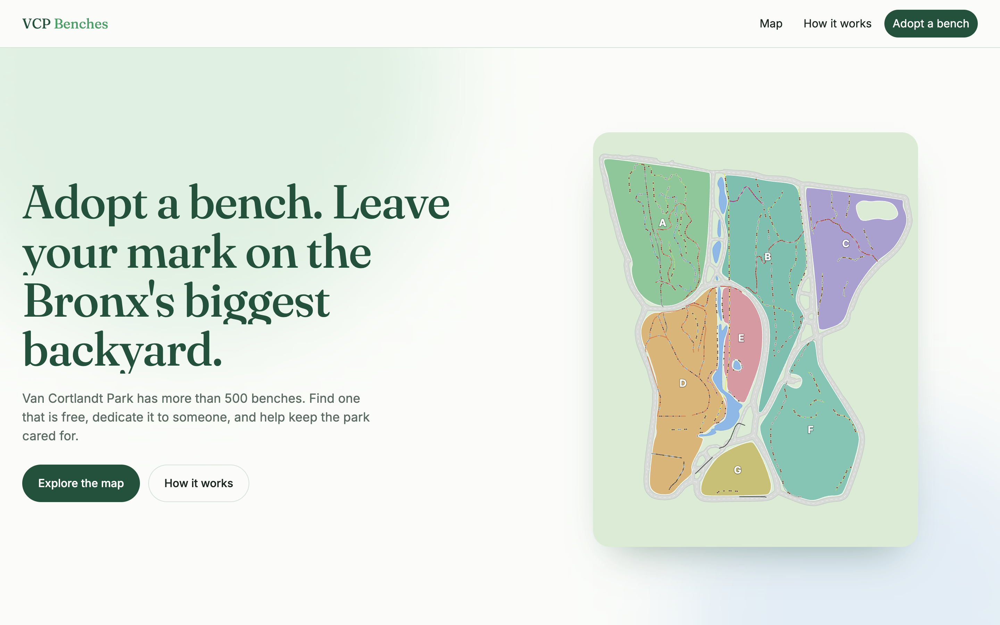
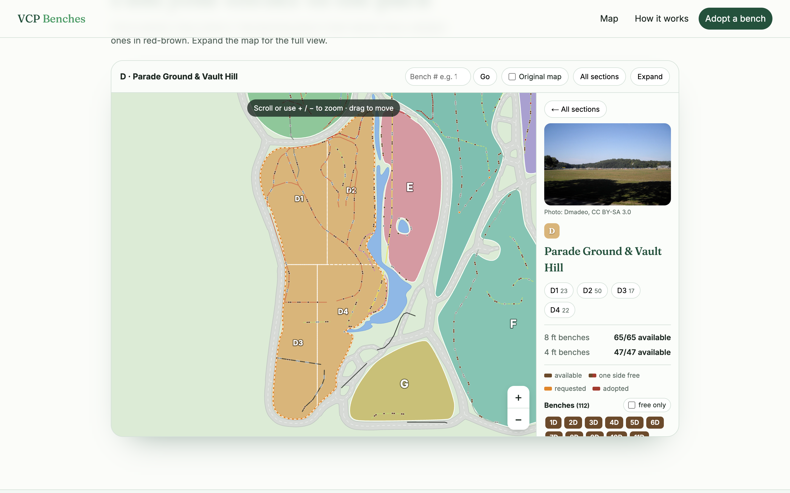
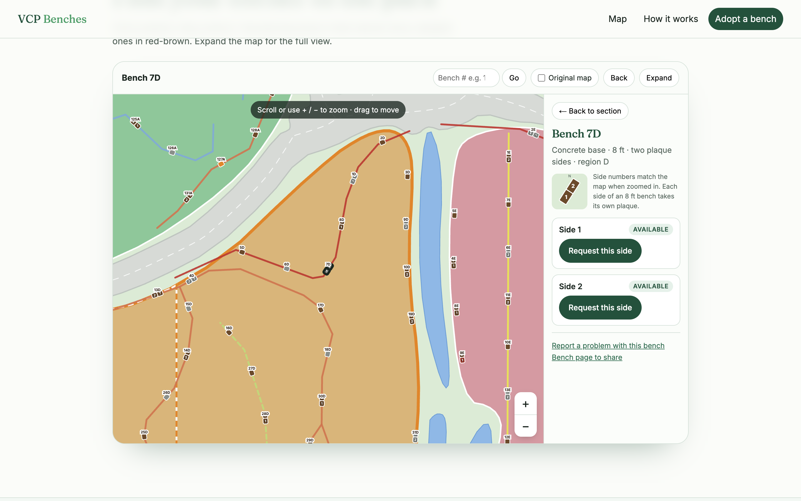
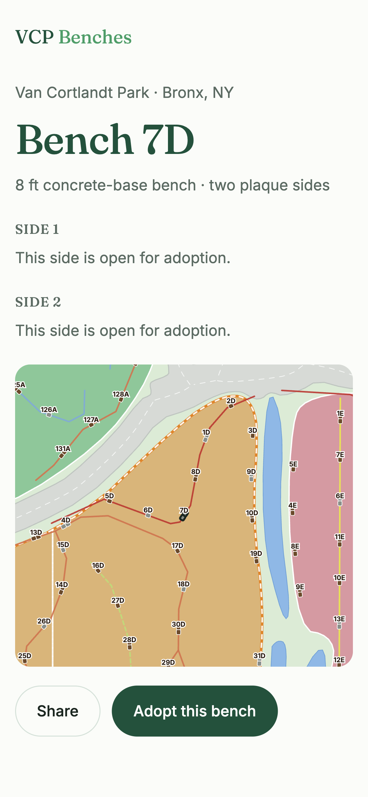
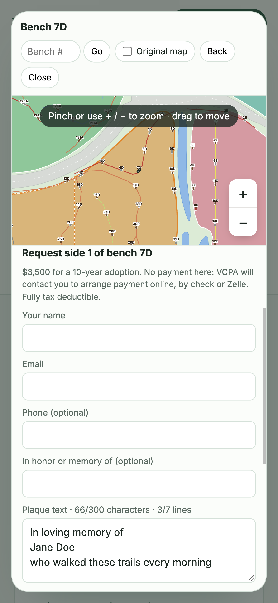
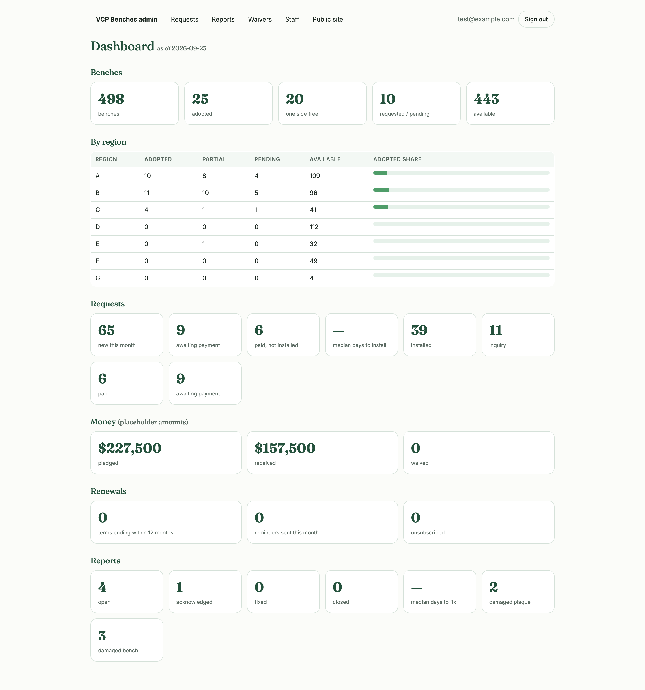
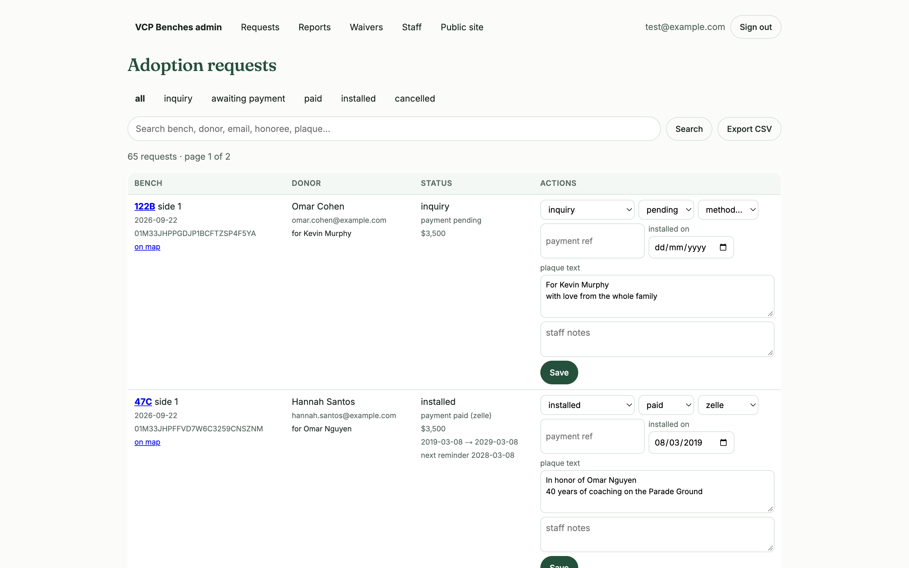
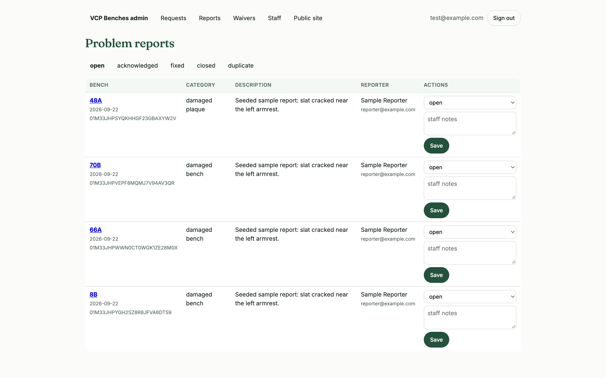

# VCP Benches

Bench adoption for Van Cortlandt Park in the Bronx. Visitors browse an interactive map of more than 500 park benches, find a free one, and request a 10-year dedication plaque. Van Cortlandt Park Alliance (VCPA) staff handle the requests, payments, installs and damage reports in an admin area.



## Features

### Interactive park map
- A traced vector map of the park, split into sections A–G and their subsections, with every bench placed on it.
- Scroll or pinch to zoom and drag to pan. Selecting a section or bench zooms to it.
- Benches are colored by status: **available**, **one side free**, **requested**, **adopted**.
- Jump straight to a bench by number (e.g. `12A`), filter to free benches only, or switch on the original VCPA map as an underlay.



### Bench details
- Each bench shows its type (World's Fair or concrete base), its size, and a status for every plaque side.
- An 8 ft bench has two plaque sides. A small diagram shows the bench's real orientation, and its side numbers match the ones on the zoomed map.
- Current adoptions are listed with the honoree, the plaque text (once installed) and the term dates, plus past adoptions.



### Request a plaque
- Pick a side and send a request with your name, email, an honoree, the plaque text (max 300 characters, 7 lines, counted live), your preferred timing, and any questions.
- No payment is taken on the site. VCPA contacts the donor to arrange payment online, by check or by Zelle. Waiver codes from VCPA can be checked in the form.
- A requested side is held for 30 days, and only one live adoption is allowed per side.

### Shareable bench pages and mobile
- Every bench has its own page at `/bench/<id>` (e.g. `/bench/7D`) with a Share button.
- On phones the map opens full-screen, and the request form gets most of the height.

<p>
  
  
</p>

### Problem reports
- Anyone can report a damaged bench, a damaged or missing plaque, graffiti or a missing bench. A new report on the same bench is added to the open one.

### Staff admin (`/admin`)
- **Dashboard**: bench status by region, the request pipeline, pledged vs. received money, upcoming renewals and report stats.
- **Requests**: move adoptions through `inquiry → awaiting_payment → paid → installed`, set term dates, add notes, and export to CSV.
- **Reports**, **Waivers** (issue and revoke codes) and **Staff** (accounts and password resets).



<p>
  
  
</p>

### Emails and renewals
- Confirmation emails go to donors and a notification goes to VCPA (via Resend; without an API key they're logged to the console).
- A daily cron (`/api/cron/reminders`) sends renewal reminders before a 10-year term ends, each with a signed unsubscribe link.

## Tech stack

Next.js (App Router), React, D3 for the map, GSAP for animations, MongoDB (with a local JSON file store fallback), and Resend for email. Deployed on Vercel. The data model and API are documented in [plan.md](plan.md).

## Getting started

```bash
npm install
cp .env.example .env.local   # fill in what you need
npm run dev                  # http://localhost:3000
```

Leave `MONGODB_URI` unset to use the local file store (`.data/db.json`). Email, Stripe and cron are optional.

Seed staff, pricing and sample data (`ADMIN_EMAIL` and `ADMIN_PASSWORD` must be set):

```bash
npx tsx tools/seed.ts
```

Other scripts:

| Command | What it does |
|---|---|
| `npx tsx tools/create-indexes.ts` | Create the MongoDB indexes (idempotent) |
| `npx tsx tools/set-password.ts <email> <password>` | Set or reset a staff password |
| `npx tsx tests/adoptions.check.ts` | Check the adoption rules against a temporary store |

## Project layout

```
app/          pages, admin and API route handlers
components/   Landing, ParkMap, BenchPanel, bench page
lib/          adoptions, auth, store (Mongo / file), email, reminders, stats
data/         bench positions, sections and map layers
tools/        seed, indexes, map tracing scripts
```

## License

The code is [MIT](LICENSE). Section photos keep the licenses credited on each photo, and the park map is traced from the Van Cortlandt Park Alliance map, which belongs to VCPA. Not affiliated with NYC Parks.
